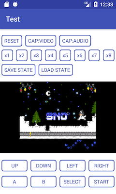

# NES Emulator for Android

## About

The NES emulator implementation for Android using [Cycloa](https://github.com/ledyba/Cycloa).



## Features

- [x] Basic NES emulator functions (load and execute)
- [x] Capture video image
- [x] Capture audio
- [x] Skip
- [ ] Save state
- [ ] Load state

## How to use on Your Project

__IMPORTANT: Your Project's license must to GPLv3 or compatible if use it. (confirm the LICENSE section)__

### (1) build.gradle

```
dependencies {
    implementation 'com.suzukiplan:nes-emulator-android:1.5.0'
}
```

> You can check the available version in the [jcenter](http://jcenter.bintray.com/com/suzukiplan/nes-emulator-android/)

### (2) layout.xml

```xml
    <com.suzukiplan.emulator.nes.core.NESView
        android:id="@+id/nes_view"
        android:layout_width="match_parent"
        android:layout_height="match_parent" />
```

> See the [example](test/src/main/res/layout/activity_main.xml)

### (3) Java/Kotlin code

```kotlin
    // find view
    val nesView:NESView = findViewById(R.id.nes_view)

    // load rom
    nesView.load(romByteArray)

    // key calculator
    val key = NESKey()

    // execute 1 frame
    nesView.tick(key.code)
```

> See the [example](test/src/main/java/com/suzukiplan/emulator/nes/test/MainActivity.kt)

## How to build

### (1) Copy on your PC

```
git clone https://github.com/suzukiplan/nes-emulator-android
cd nes-emulator-android
git submodule init
git submodule update
```

### (2) Build with Android Studio

Please open this project on Android Studio 3.0 or later,
then you can build with choose `test` module.

## License

- NES Emulator for Android: [GPLv3](LICENSE.txt)
- Cycloa: [GPLv3](https://github.com/ledyba/Cycloa)
- Example ROM - `Snow Demo by Tennessee Carmel-Veilleux`: Public Domain	 

> __NOTE:__ The liberal license of `NES Emulator for Android` without Cycloa edition is exist but not open. Please contact SUZUKI PLAN directly about it.
